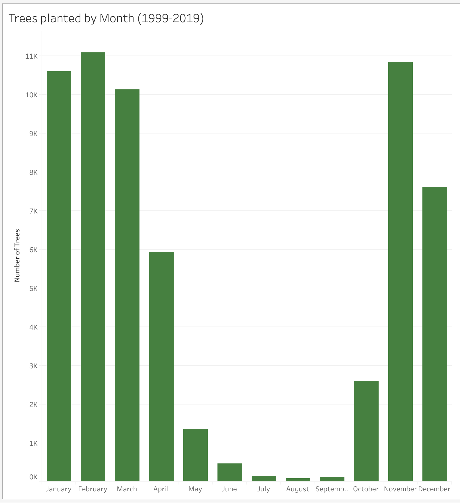

## Task 3: Time Series

### 3.1. Trees planted by Year 
Create a new sheet called `C1` and plot the number of trees planted and the date they were planted so our two columns of interest are `date_plated` and `tree_id`.

#### Instructions 
1. Drag the `date_planted` variable to the "**Columns**" toolbar and again the `tree_id` to "**Rows**". We are again interested in the amount of trees planted at selected dates so once again we want to transform this to a "**Count**" type "**Measure**".  
1. Since `date_planted' is a continuous variable, it's a good idea to right-click and transform this into a **Continuous** Dimension. 
1. This automatically generates the number of trees planted at each year (but there are null values!)
1. We can change this to:
    - month - discrete (Top month choice when right-clicking)  which aggregates months together for all years 
    - month - continuous (Bottom month choice when right-clicking) which will make a sequential plot.
1. Combining scatterplot onto our line graph by adding an identical `tree_id` to rows and converting it to a counting measurement again. At first, we should get 2 graphs on top of each other. We can right-click one of them and select "**Dual Axis**".
This will superimpose one on another with a left and a right axis title. We can hide the one on the right by right-clicking the axis and unticking the "**Show Header**" option. 
1. To change the colour of the line and the points, we need to make sure we change the colour of both measures by selecting the "**All**" tab under the "**Marks**" card on the right.      
1. Don't forget to give it a title and edit the y-axis label as we did earlier.

#### Output

### 3.2. Trees planted by Month 

Create a new sheet called `C2` that has the count of trees planted by month over the years. In other words, across all years, January trees should be reported together.
Add a filter so that the `root_barrier` is set to N.

#### Output

