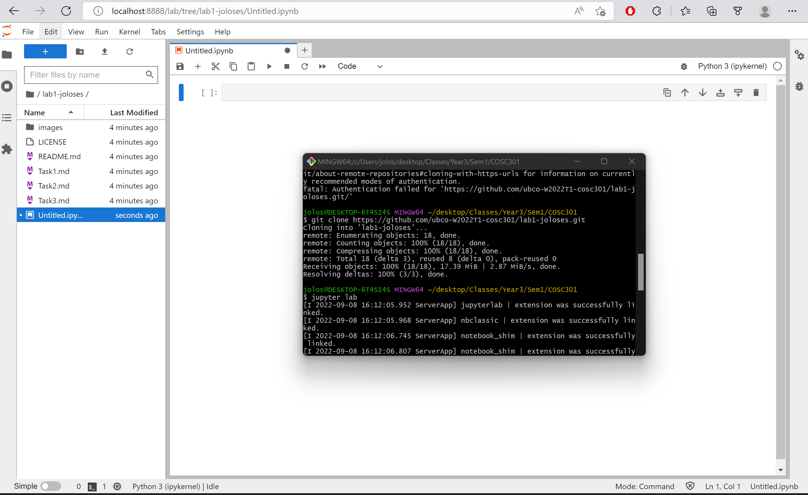

`print('hello world')`

``` num = 10
        if num < 5:
            print ('Number is less than 5.')
        else:
            print('Number is greater than 5.')
```

    
---
[Google](https://www.google.ca/)



| Fruit | Colour | Shape | Size |
| ----- | ------ | ----- | ---- |
| Grape | Purple | Sphere| Small|
| Watermelon | Green/Red        | Oval      | Large      |
| Orange      | Orange        | Sphere       | Medium      |
| Apple | Red | Sphere-ish | Medium |
| Blueberry | Blue | sphere | small |
| Stafruit | Yellow | Star | Medium/small
